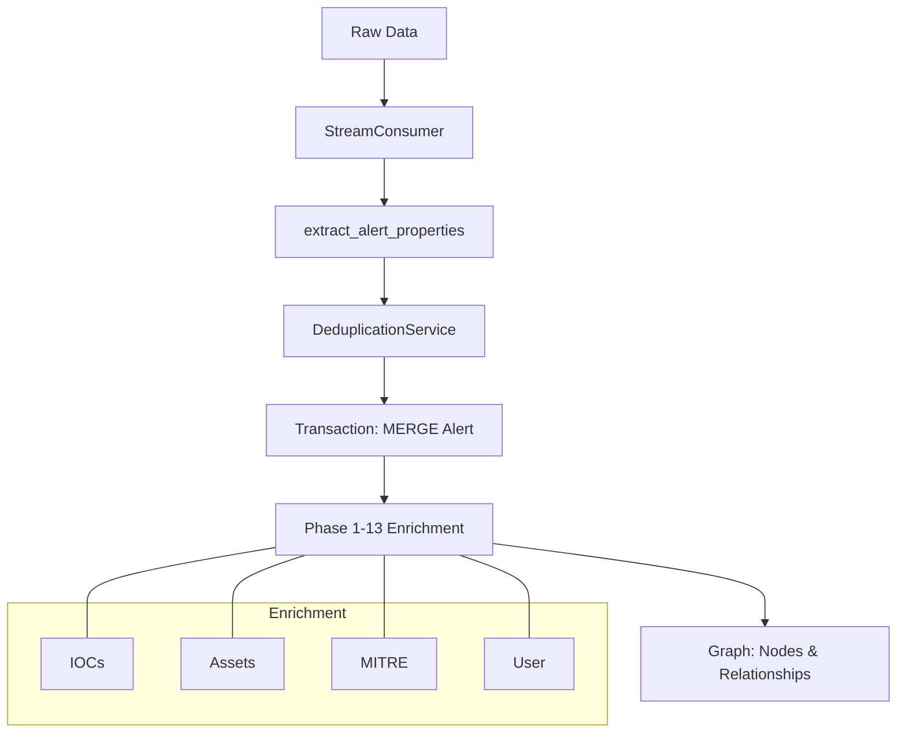
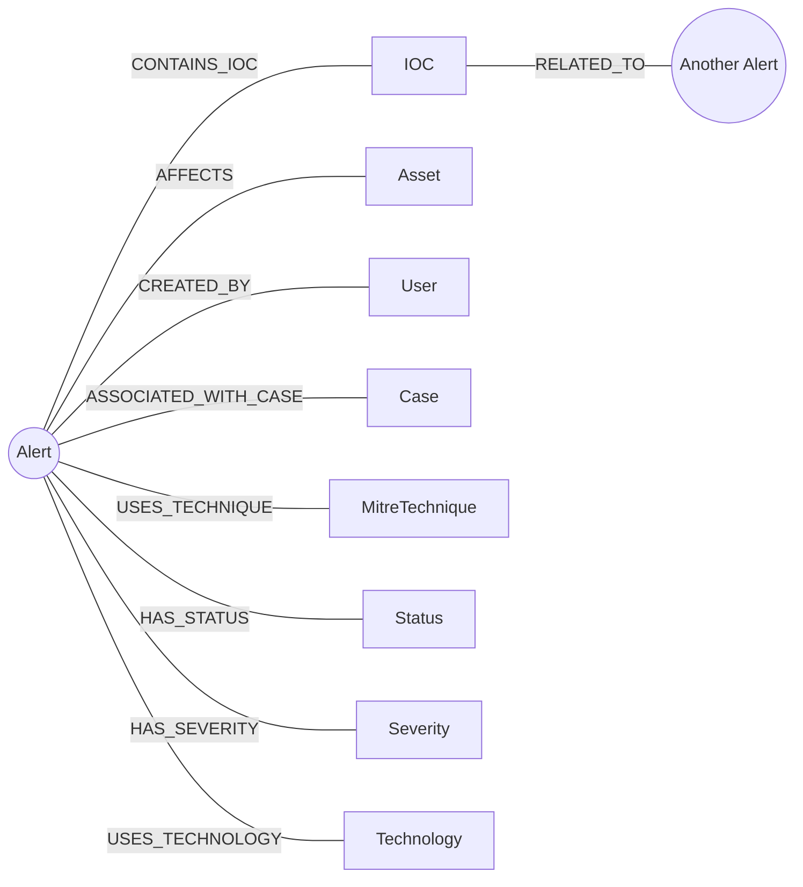

# Alert Node Creation & Fields Mapping Guide

This document provides a detailed breakdown of how `Alert` nodes and their associated entities are created within the `graph_module`. It specifies the input fields, extraction logic, and the resulting graph structure.

## 1. Overview of the Creation Flow

The process is orchestrated by `create_alert` in `core/alerts/services.py`, which delegates the heavy lifting to `_create_nodes_and_relationships_tx`.

### Ingestion Pipeline Flow


1.  **Standardization**: Input data (normalized and raw) is processed by `extract_alert_properties` to map diverse source formats to a single schema.
2.  **Transaction Execution**: All operations occur within a single Neo4j transaction for atomicity.
3.  **Entity Deduplication**: Attributes like `Status`, `Severity`, and `Source` are created/retrieved via a `DeduplicationService` to prevent redundant nodes.
4.  **Relationship Building**: Links are established between the `Alert` and its associated `IOC`, `Asset`, `User`, `Technology`, etc.

---

## 2. The Alert Node

The `Alert` node is the central hub. It is uniquely identified by its `id` (source `ticket_id`).

### Fields used for Property Mapping

| Graph Property | Source Field (Normalized/Raw) | Description |
| :--- | :--- | :--- |
| `id` | `ticket_id` | Primary unique identifier. |
| `tenant_id` | `tenant_id` | Scopes data to a specific organization. |
| `source` | `source` | The reporting source (e.g., "Kaduu", "Sentinel"). |
| `title` | `title` | Short summary of the alert. |
| `description` | `description` | Full detail of the event. |
| `status` | `status` | Normalized status (e.g., "new", "resolved"). |
| `severity` | `severity` | Normalized severity level. |
| `raw_severity` | `raw_severity` | The original severity string from the source. |
| `alert_type` | `alert_type` | The classification of alert. |
| `category` | `category` | Threat category. |
| `confidence` | `confidence` | Confidence level of the detection. |
| `first_seen` | `first_seen` | Timestamp of initial ingestion. |
| `last_updated` | `last_updated` | Timestamp of the most recent update. |

---

## 3. Associated Nodes & Relationships

### Graph Relationship Schema


### A. Indicators of Compromise (IOC)
- **Node**: `(i:IOC {value: <ioc_value>, tenant_id: <tenant_id>})`
- **Relationship**: `(Alert)-[:CONTAINS_IOC]->(IOC)`
- **Extraction Logic**: Pulled from `ioc_list`, `indicators`, `ip_addresses`, etc., via `extract_iocs()`.

### B. Assets
- **Node**: `(n:Asset {asset_value: <name>, asset_type: <type>, tenant_id: <tenant_id>})`
- **Relationship**: `(Alert)-[:AFFECTS]->(Asset)`
- **Extraction Logic**: Extracted from `related_assets` or `affected_host` fields.

### C. Attributes (Status, Severity, Source, etc.)
These are "Value Nodes" used for filtering and aggregation.
- **Node Labels**: `Status`, `Severity`, `Source`, `Category`, `Environment`, `Confidence`.
- **Relationship**: `(Alert)-[:HAS_STATUS]->(Status)`, `(Alert)-[:HAS_SEVERITY]->(Severity)`, etc.
- **Logic**: Processed through `DeduplicationService` to ensure `tenant_id` isolation.

### D. User
- **Node**: `(u:User {id: <user_id>, tenant_id: <tenant_id>})`
- **Relationship**: `(Alert)-[:CREATED_BY]->(User)`
- **Logic**: Linked if `user_id` or `created_by_email` is found in the alert metadata.

### E. Technology
- **Node**: `(t:Technology {name: <product>, vendor: <vendor>, version: <version>})`
- **Relationship**: `(Alert)-[:USES_TECHNOLOGY]->(Technology)`
- **Logic**: Extracted from `technologies` array, often including CPE identifiers.

---

## 4. Extraction Utilities

The logic for "finding" these fields is contained in `core/alerts/utils.py`. Key functions include:
- `extract_alert_properties()`: The main mapper.
- `extract_iocs()`: Robust multi-field search for indicators.
- `extract_assets()`: Identifies target machines, IPs, and users.
- `sanitize_for_neo4j()`: Ensures data types are compatible with Cypher properties.

---

## 5. Detailed Relationship Mapping

Relationships in the Alert module are categorized by their purpose:

### Structural & Core Relationships
These link the Alert to its primary entities.

| Relationship Type | Target Label | Description |
| :--- | :--- | :--- |
| `CONTAINS_IOC` | `IOC` | Links to indicators extracted from the alert. |
| `AFFECTS` | `Asset` | Links to the systems or entities targeted by the alert. |
| `CREATED_BY` | `User` | Links to the user who reported or system that generated the alert. |
| `ASSOCIATED_WITH_CASE`| `Case` | Links the alert to its parent management case. |
| `INVESTIGATES` | `Alert` | (Reverse) The case explores the alert. |

### Attribute & Taxonomy Relationships
These link the Alert to standardized value nodes for filtering.

| Relationship Type | Target Label | Used for... |
| :--- | :--- | :--- |
| `HAS_STATUS` | `Status` | Standardized lifecycle tracking. |
| `HAS_SEVERITY` | `Severity` | Priority and risk assessment. |
| `HAS_CONFIDENCE` | `Confidence` | Accuracy of detection. |
| `HAS_ALERT_TYPE` | `AlertType` | Behavioral classification. |
| `HAS_SOURCE` | `Source` | Data origin tracking. |
| `IN_ENVIRONMENT` | `Environment` | Context (e.g., "Production", "Staging"). |

### Behavioral & Contextual Relationships
Links established based on extracted context (MITRE, Evidence, etc.).

| Relationship Type | Target Label | Description |
| :--- | :--- | :--- |
| `USES_TECHNIQUE` | `MitreTechnique` | Maps the alert to the MITRE ATT&CK framework. |
| `HAS_EVIDENCE` | `Evidence` | Links to supporting files, logs, or screenshots. |
| `USES_TECHNOLOGY` | `Technology` | Identifies the software/hardware stack involved. |
| `HAS_IMPACT` | `Impact` | Links to the potential business impact. |
| `RELATED_TO_ENTITY` | `Entity` | Generic links to unstructured related entities. |

---

## 6. Smart Relationship Logic

The graph module implements "Smart" relationship management to ensure the graph remains clean and accurate over time:

### A. Smart Updates (Relationship Pruning)
For relationships like `AFFECTS`, `USES_TECHNIQUE`, and `RELATED_TO_ENTITY`, the system performs automatic cleanup. When an alert is updated:
1.  New entities are **merged**.
2.  Existing relationships to entities **not present** in the latest update are **deleted**.
This prevents "ghost" relationships from sticking around if an alert is revised to remove an asset or technique.

### B. Single-Value Enforcement
For attributes that should only have one value (like `Status` or `Severity`), the system uses a pruning match:
```cypher
MATCH (a)-[r:HAS_STATUS]->(old)
WHERE id(old) <> $new_entity_id
DELETE r
```
This ensures that an alert never has two different Status nodes simultaneously.

### C. Automatic Correlation (Shared Indicators)
If two different Alerts (`A` and `B`) share the same `IOC` node, the system automatically creates a bi-directional `RELATED_TO` link between them:
- `(Alert A)-[:RELATED_TO {type: 'shared_indicators'}]->(Alert B)`

---

## 7. Field Usage Breakdown: Nodes vs. Relationships

This table summarizes exactly how the input fields (from the `normalized` or `raw` data) are utilized.

### Fields used as Node Properties
These fields are stored directly on the `Alert` node's property map in Neo4j.

| Input Field | Node Property | Description |
| :--- | :--- | :--- |
| `ticket_id` | `id` / `ticket_id` | Unique identifier. |
| `title` | `title` | The alert headline. |
| `description` | `description` | Detailed text. |
| `source` | `source` | Originating system name. |
| `status` | `status` | Normalized status string. |
| `severity` | `severity` | Normalized severity level. |
| `raw_severity` | `raw_severity` | Original severity string. |
| `category` | `category` | Threat category. |
| `confidence` | `confidence` | Detection confidence level. |
| `updated_at` | `updated_at` | Last modification time. |
| `alert_type` | `alert_type` | Behavioral class. |
| `tenant_id` | `tenant_id` | Partitioning ID. |

### Fields used for Relationship Creation
These fields are used to search for, create, or link to **other** nodes.

| Input Field | Target Node Label | Relationship Type | Logic Description |
| :--- | :--- | :--- | :--- |
| `ioc_list` / `indicators` | `IOC` | `CONTAINS_IOC` | Creates/links to an indicator node. |
| `related_assets` / `host`| `Asset` | `AFFECTS` | Creates/links to a system or entity. |
| `case_id` | `Case` | `ASSOCIATED_WITH_CASE`| Links the alert to its Incident Case. |
| `user_id` / `email` | `User` | `CREATED_BY` | Links to the responsible analyst or user. |
| `mitre_techniques` | `MitreTechnique` | `USES_TECHNIQUE` | Connects behavior to the MITRE framework. |
| `technologies` | `Technology` | `USES_TECHNOLOGY` | Links involved software/hardware. |
| `business_impacts` | `Impact` | `HAS_IMPACT` | Maps to potential business risks. |
| `evidence` | `Evidence` | `HAS_EVIDENCE` | Links to logs or screenshots. |
| `related_entities` | `Entity` | `RELATED_TO_ENTITY` | Links to generic unstructured entities. |
| `environment` | `Environment` | `IN_ENVIRONMENT` | Links to the network context node. |

---

## 8. Technical Deep-Dive

### A. The Deduplication Service
The system uses a `DeduplicationService` (passed to services via `dedup_service`) to ensure that value-based nodes (like `Severity`, `Status`, `Source`) are unique within a `tenant_id`.

**The Logic**:
1.  Check the `deduplication/config.py` for the primary identifying property of a label (e.g., `Severity` uses `value`, `Environment` uses `name`).
2.  Perform a `MERGE` operation using the value, the property name, and the `tenant_id`.
3.  Return the internal Neo4j `element_id` to the calling service for efficient relationship linking.

### B. Fallback Extraction Logic
In `core/alerts/utils.py`, the `extract_alert_properties` function follows a strict priority to ensure data is never missed:
1.  **Stage 1 (Primary)**: Look in the `normalized` block (mapped by the ingestion pipelines).
2.  **Stage 2 (Secondary)**: Look in the `root` block of the incoming JSON.
3.  **Stage 3 (Fallback)**: Look in the `raw` dictionary inside the alert.
4.  **Stage 4 (Default)**: Use systemic defaults (e.g., `status = "new"`, `severity = "unknown"`).

### C. Transactional Atoms & Retries
Alert creation is designed to be **atomic**. The `create_alert` function uses an internal `async def work(tx)` function wrap.

```python
async def work(tx):
    # 1. Existence Check
    # 2. Update OR Create logic
    # 3. Comprehensive Enrichment (Phase 1-13)
    # 4. Final Verification check
```

This whole block is executed via `execute_with_retry`, which handles potential transient Neo4j errors (like deadlocks or connectivity blips) automatically.

### D. Asset Standardization
Assets are standardized into a list of dictionaries before ingestion. If an Asset ID is missing, the system generates a **deterministic UUID**:
```python
a_id = hashlib.md5(f"{tenant_id}_{a_type}_{name}".encode()).hexdigest()
```
---

## 9. Sample Alert Data

Below is a representative sample of an incoming alert JSON (Cyberint source). This data structure is what drives the extraction and property mapping described above.

```json
{
  "_id": {
    "$oid": "6942a26e270301e3014acdab"
  },
  "ticket_id": "TKT-1765974556-9a5737cb",
  "raw": {
    "id": 9007315,
    "environment": "AXPO",
    "ref_id": "AXP1-1999",
    "confidence": 80,
    "status": "closed",
    "severity": "high",
    "created_date": "2024-11-06T12:20:15",
    "created_by": {
      "email": "system"
    },
    "category": "data",
    "type": "compromised_employee_credentials",
    "source_category": "leaked_data",
    "source": null,
    "targeted_vectors": [],
    "targeted_brands": [
      "AXPO"
    ],
    "related_entities": [
      "https://sso.axpo.com/",
      "https://access.axpo.com/vpn/index.html",
      "portalagentes.axpo.com",
      "https://portalagentes.axpo.com/login",
      "https://sso.axpo.com",
      "access.axpo.com",
      "sso.axpo.com",
      "sso.axpo.com/"
    ],
    "impacts": [
      "data_compromise",
      "unauthorized_access",
      "account_takeover"
    ],
    "acknowledged_date": "2024-12-30T12:44:13",
    "acknowledged_by": {
      "email": "sofia.fernandezgomez@axpo.com"
    },
    "publish_date": "2024-10-16T19:11:12",
    "title": "Company Employee Corporate Credentials Exposed",
    "alert_data": {
      "domain": "axpo.com",
      "csv": {
        "id": 6661760,
        "name": "leaked_credentials.csv",
        "mimetype": "text/csv",
        "is_safe": true,
        "content": null
      },
      "total_first_seen": 1,
      "total_credentials": 3,
      "credentials_dump_ids": {
        "[\"javier.gonzalezgarcia@axpo.group\", \"Susana88\"]": [
          42074755,
          43752391,
          68855511,
          44404173,
          46435728,
          45782486,
          43043190,
          43595546
        ],
        "[\"javier.gonzalezgarcia@axpo.com\", \"Virginidadgarcia1_\"]": [
          43843329,
          43916045,
          41672976,
          58506517,
          45005080,
          58230555,
          58621213,
          46782749,
          58548016,
          68796210,
          44276283,
          43126845,
          61871680,
          61728582,
          69254990,
          43829327,
          58493520,
          49672274,
          45685077,
          69652569,
          70318172,
          43861597,
          69762141,
          58413409,
          58526055,
          45857640,
          48405864,
          58787179,
          48854382,
          48455792,
          43954545,
          58524017,
          43468151,
          71657087,
          58127749,
          42076550,
          45679499,
          45550222,
          44372625,
          69397906,
          46065299,
          69510038,
          71374487,
          43766681,
          58428570,
          61620638,
          68700579,
          58520996,
          60702118,
          58785195,
          61653931,
          44362931,
          58320055,
          58567868,
          66141386,
          43893709,
          43097299,
          61616595,
          43941339,
          58536929,
          42760675,
          58449637,
          49092839,
          66906344,
          43964137,
          50491626,
          58569963,
          58128107,
          58010607,
          44362992,
          43734515,
          58038517,
          42265334,
          43888632,
          43516414,
          42644479
        ]
      }
    },
    "iocs": [],
    "indicators": [
      {
        "id": "4b47c9641625e8cdcdaf8da5fcf83a8eb19e8b97e65c50b1a4d5ffeeba4b1015",
        "title": "File found online",
        "publish_date": 1699889012,
        "created_date": 1739784019,
        "category": "Malware Log",
        "source": "Malware Logs",
        "author": null,
        "is_global": false
      }
    ],
    "ticket_id": null,
    "threat_actor": null,
    "modification_date": "2025-12-13T12:36:15",
    "closure_date": "2024-12-30T12:44:13",
    "closed_by": {
      "email": "sofia.fernandezgomez@axpo.com"
    },
    "closure_reason": "false_positive",
    "closure_reason_description": null,
    "description": "Corporate employee credentials are the credentials of an employee for an interface used in the organization. These credentials were harvested from a machine that was infected by malware. The malware logged the credentials it managed to steal, and the log was collected, analyzed, and found to contain corporate credentials.\nBoth usernames and passwords are critical in allowing threat actors to cause the most damage to businesses, using them to obtain sensitive, internal information and even gain access to internal systems that will authorize these credentials or similar ones. Furthermore, compromised credentials can be used for phishing, spreading malware, identity theft, and even compromising more accounts using the initial entry credentials.\n",
    "recommendation": "Best practices include determining whether the credentials can be used to access any internal system or whether they are no longer effective. If the credentials can be used by an employee to authorize access to an internal system, the employee should be informed about the compromise and instructed to reset the credentials. Alternatively, a forced password reset of all interfaces and systems with identical or similar credentials should be executed. Furthermore, the account is considered compromised and its activity after the infection date should be investigated for suspicious activity.\n\nNote that the malware could still be active on the machine. Therefore, if the machine was connected to internal systems, the infected client IP should be investigated, and a compromise assessment should be conducted. In addition, anti-virus tools to protect against, detect and remove malware should be integrated into the system.\n\nAdditionally, after the mitigation, it should be evaluated whether the current processes are safe and if not, make improvements where possible; for example, in case of many matched leaked credentials, changing the entire password policy across the organization might be appropriate. Similarly, if inactive users are found in Active Directory, it may be beneficial to revisit the employee offboarding process.\n",
    "tags": [],
    "analysis_report": null,
    "attachments": [],
    "mitre": [
      "T1591",
      "T1593",
      "T1594",
      "T1589"
    ],
    "related_assets": [
      {
        "name": "axpo.com",
        "id": "domain/AXPO/axpo.com",
        "type": "domain"
      },
      {
        "name": "access.axpo.com",
        "id": "employee login interface/AXPO/access.axpo.com",
        "type": "employee login interface"
      },
      {
        "name": "portalagentes.axpo.com",
        "id": "employee login interface/AXPO/portalagentes.axpo.com",
        "type": "employee login interface"
      },
      {
        "name": "sso.axpo.com",
        "id": "employee login interface/AXPO/sso.axpo.com",
        "type": "employee login interface"
      }
    ],
    "update_date": "2025-12-13T12:36:15",
    "assigned_to": null
  },
  "source": "cyberint",
  "analyst_fields": {},
  "system_status": "new",
  "template_id": "1",
  "case_id": null,
  "has_case": false,
  "connector_id": "cyberint_new_4954",
  "normalized": {
    "id": "AXP1-1999",
    "created_at": "2024-11-06 12:20:15",
    "updated_at": null,
    "title": "Company Employee Corporate Credentials Exposed",
    "description": "Corporate employee credentials are the credentials of an employee for an interface used in the organization. These credentials were harvested from a machine that was infected by malware. The malware logged the credentials it managed to steal, and the log was collected, analyzed, and found to contain corporate credentials.\nBoth usernames and passwords are critical in allowing threat actors to cause the most damage to businesses, using them to obtain sensitive, internal information and even gain access to internal systems that will authorize these credentials or similar ones. Furthermore, compromised credentials can be used for phishing, spreading malware, identity theft, and even compromising more accounts using the initial entry credentials.\n",
    "alert_type": "compromised_employee_credentials",
    "category": "data",
    "mitre": [
      "T1591",
      "T1593",
      "T1594",
      "T1589"
    ],
    "severity": "high",
    "status": "closed",
    "confidence": 80,
    "targeted_brands": [
      "AXPO"
    ],
    "targeted_vectors": [],
    "business_impacts": [
      "data_compromise",
      "unauthorized_access",
      "account_takeover"
    ],
    "publish_date": "2024-10-16T19:11:12",
    "acknowledged_date": "2024-12-30T12:44:13",
    "closure_date": "2024-12-30T12:44:13",
    "modification_date": "2025-12-13T12:36:15",
    "first_activity_time": null,
    "last_activity_time": null,
    "created_by": {
      "email": "system",
      "name": null,
      "role": null
    },
    "acknowledged_by": {
      "email": "sofia.fernandezgomez@axpo.com",
      "name": null,
      "role": null
    },
    "closed_by": {
      "email": "sofia.fernandezgomez@axpo.com",
      "name": null,
      "role": null
    },
    "detection_source": null,
    "product_name": null,
    "classification": null,
    "determination": null,
    "alert_web_url": null,
    "incident_web_url": null,
    "detection_stream": null,
    "alert_policy_name": null,
    "assigned_user_on_service": null,
    "service_investigation_state": null,
    "service_policy_id": null,
    "automation_status": null,
    "remediation_status": null,
    "recommendation": "Best practices include determining whether the credentials can be used to access any internal system or whether they are no longer effective. If the credentials can be used by an employee to authorize access to an internal system, the employee should be informed about the compromise and instructed to reset the credentials. Alternatively, a forced password reset of all interfaces and systems with identical or similar credentials should be executed. Furthermore, the account is considered compromised and its activity after the infection date should be investigated for suspicious activity.\n\nNote that the malware could still be active on the machine. Therefore, if the machine was connected to internal systems, the infected client IP should be investigated, and a compromise assessment should be conducted. In addition, anti-virus tools to protect against, detect and remove malware should be integrated into the system.\n\nAdditionally, after the mitigation, it should be evaluated whether the current processes are safe and if not, make improvements where possible; for example, in case of many matched leaked credentials, changing the entire password policy across the organization might be appropriate. Similarly, if inactive users are found in Active Directory, it may be beneficial to revisit the employee offboarding process.\n",
    "tags": [],
    "threat_actor": null,
    "threat_family_name": null,
    "related_entities": [
      "https://sso.axpo.com/",
      "https://access.axpo.com/vpn/index.html",
      "portalagentes.axpo.com",
      "https://portalagentes.axpo.com/login",
      "https://sso.axpo.com",
      "access.axpo.com",
      "sso.axpo.com",
      "sso.axpo.com/"
    ],
    "related_assets": [
      {
        "id": "domain/AXPO/axpo.com",
        "name": "axpo.com",
        "type": "domain"
      },
      {
        "id": "employee login interface/AXPO/access.axpo.com",
        "name": "access.axpo.com",
        "type": "employee login interface"
      },
      {
        "id": "employee login interface/AXPO/portalagentes.axpo.com",
        "name": "portalagentes.axpo.com",
        "type": "employee login interface"
      },
      {
        "id": "employee login interface/AXPO/sso.axpo.com",
        "name": "sso.axpo.com",
        "type": "employee login interface"
      }
    ],
    "iocs": [],
    "attachments": [],
    "analysis_report": null,
    "alert_data": {
      "csv": {
        "id": 6661760,
        "name": "leaked_credentials.csv",
        "mimetype": "text/csv",
        "is_safe": true,
        "content": null
      },
      "total_credentials": 3,
      "hashed_attachment_content_csv": null,
      "username": null,
      "email": null,
      "password": null,
      "domain": "axpo.com",
      "total_first_seen": 1,
      "credentials_dump_ids": {
        "[\"javier.gonzalezgarcia@axpo.group\", \"Susana88\"]": [
          42074755,
          43752391,
          68855511,
          44404173,
          46435728,
          45782486,
          43043190,
          43595546
        ],
        "[\"javier.gonzalezgarcia@axpo.com\", \"Virginidadgarcia1_\"]": [
          43843329,
          43916045,
          41672976,
          58506517,
          45005080,
          58230555,
          58621213,
          46782749,
          58548016,
          68796210,
          44276283,
          43126845,
          61871680,
          61728582,
          69254990,
          43829327,
          58493520,
          49672274,
          45685077,
          69652569,
          70318172,
          43861597,
          69762141,
          58413409,
          58526055,
          45857640,
          48405864,
          58787179,
          48854382,
          48455792,
          43954545,
          58524017,
          43468151,
          71657087,
          58127749,
          42076550,
          45679499,
          45550222,
          44372625,
          69397906,
          46065299,
          69510038,
          71374487,
          43766681,
          58428570,
          61620638,
          68700579,
          58520996,
          60702118,
          58785195,
          61653931,
          44362931,
          58320055,
          58567868,
          66141386,
          43893709,
          43097299,
          61616595,
          43941339,
          58536929,
          42760675,
          58449637,
          49092839,
          66906344,
          43964137,
          50491626,
          58569963,
          58128107,
          58010607,
          44362992,
          43734515,
          58038517,
          42265334,
          43888632,
          43516414,
          42644479
        ]
      },
      "evidence": [
        {
          "id": "4b47c9641625e8cdcdaf8da5fcf83a8eb19e8b97e65c50b1a4d5ffeeba4b1015",
          "title": "File found online",
          "publish_date": 1699889012,
          "created_date": 1739784019,
          "category": "Malware Log",
          "source": "Malware Logs",
          "author": null,
          "is_global": false
        }
      ]
    },
    "csv_data": null,
    "evidence_summary": {
      "total_count": 1,
      "sources": {
        "Malware Logs": 1
      },
      "categories": {
        "Malware Log": 1
      }
    },
    "service_metadata": null,
    "connector_metadata": {
      "connector_type": "cyberint",
      "connector_version": null,
      "original_id": "9007315",
      "original_ref_id": "AXP1-1999",
      "source": null,
      "source_category": "leaked_data",
      "ingested_at": "2025-12-17 12:29:16.596192"
    },
    "ticket_id": null,
    "incident_id": null,
    "closure_reason": "false_positive",
    "environment": "AXPO"
  },
  "external_id": "9007315",
  "tenant_id": "68d391490c8ff3c6855b2f60",
  "created_by": "cyberint_new_4954",
  "created_at": {
    "$date": "2025-12-17T12:30:38.238Z"
  },
  "updated_at": {
    "$date": "2025-12-17T12:30:38.238Z"
  },
  "pipeline_version": "v2"
}
---

## 10. Mapping the Sample JSON to the Graph

Using the sample data in Section 9, here is exactly how the system decomposes the JSON into the graph:

### A. Core Node Creation (The Hub)
*   **Field**: `ticket_id` (`TKT-1765974556-9a5737cb`)
*   **Action**: Creates the `Alert` node.
*   **Property Mapping**:
    *   `a.id` = `ticket_id`
    *   `a.title` = `normalized.title`
    *   `a.severity` = `normalized.severity`
    *   `a.tenant_id` = `tenant_id`

### B. Relationship: AFFECTS (Assets)
*   **Field**: `normalized.related_assets` (List of objects)
*   **Action**: Iterates through the list and creates/links `Asset` nodes.
*   **Logic**:
    *   Takes `name: "axpo.com"` and `type: "domain"`.
    *   Performs: `MERGE (a:Alert)-[:AFFECTS]->(asset:Asset {asset_value: "axpo.com", asset_type: "domain"})`.

### C. Relationship: USES_TECHNIQUE (MITRE)
*   **Field**: `normalized.mitre` (`["T1591", "T1593", ...]`)
*   **Action**: Creates nodes for each technique and links them.
*   **Logic**: `MERGE (a:Alert)-[:USES_TECHNIQUE]->(t:MitreTechnique {id: "T1591"})`.

### D. Relationship: HAS_STATUS & HAS_SEVERITY (Deduplication)
*   **Field**: `normalized.status` (`"closed"`) and `normalized.severity` (`"high"`)
*   **Action**: Passes value to `DeduplicationService`.
*   **Logic**:
    1.  Finds/Creates a global `Status` node with `value: "closed"`.
    2.  Links: `MERGE (a:Alert)-[:HAS_STATUS]->(s:Status)`.
    *   *Note: This ensures all "closed" alerts across the platform point to the exact same Status node.*

### E. Relationship: HAS_EVIDENCE (Indicators)
*   **Field**: `raw.indicators`
*   **Action**: Creates `Evidence` nodes for supporting metadata.
*   **Logic**: `MERGE (a:Alert)-[:HAS_EVIDENCE]->(e:Evidence {id: "4b47c9..."})`.
